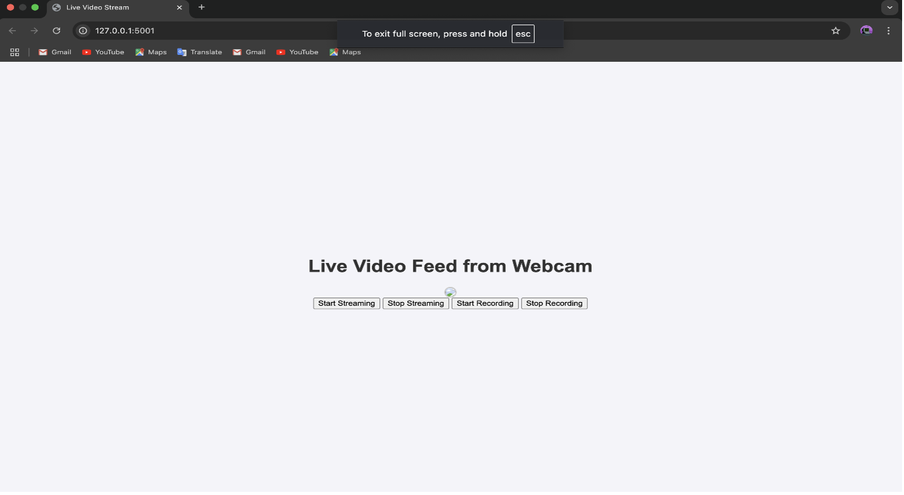

# VideoStreamer
 Real Time Video Streaming Platform with Python

## Overview
This project simulates a real-world media streaming service. It features a server capable of streaming compressed video content to clients using modern protocols and technologies. The service is controlled remotely via a REST API, allowing dynamic interaction during operation. The implementation emphasizes efficiency, scalability, and real-time performance.

## Tools Used
1. Python: The primary programming language for server-side development.
2. Flask: A lightweight web framework used to build the REST API.
3. GStreamer: A powerful multimedia framework for video processing and streaming.

## System Architecture
The system architecture consists of a Flask-based server integrated with GStreamer to handle video capture and streaming. Clients interact with the server through REST API endpoints to start and stop the video stream dynamically.



```python

def generate_frames():
    global video_writer
    while True:
        if not streaming:
            break

        # Pull the latest sample from the appsink
        sample = appsink.emit("pull-sample")
        if not sample:
            break

        buffer = sample.get_buffer()
        caps = sample.get_caps()
        height = caps.get_structure(0).get_value("height")
        width = caps.get_structure(0).get_value("width")

        # Map the buffer to extract data
        success, map_info = buffer.map(Gst.MapFlags.READ)
        if not success:
            continue

        frame_data = np.frombuffer(map_info.data, dtype=np.uint8)
        buffer.unmap(map_info)

        # Convert YUY2 to BGR using OpenCV
        frame = frame_data.reshape((height, width, 2))
        frame = cv2.cvtColor(frame, cv2.COLOR_YUV2BGR_YUY2)

        # Convert to grayscale for recording
        gray_frame = cv2.cvtColor(frame, cv2.COLOR_BGR2GRAY)

        # Save the frame to the video file if recording
        if recording:
            if video_writer is None:
                # Initialize VideoWriter when recording starts
                fourcc = cv2.VideoWriter_fourcc(*'M', 'J', 'P', 'G')
                video_writer = cv2.VideoWriter(output_file, fourcc, fps, (width, height), True)
            video_writer.write(frame)

        # Encode the frame in JPEG format for streaming
        _, buffer = cv2.imencode('.jpg', frame)
        frame = buffer.tobytes()

        # Yield the frame
        yield (b'--frame\r\n'
               b'Content-Type: image/jpeg\r\n\r\n' + frame + b'\r\n')
```

<br>**The generate_frames()** function, as shown in code above, plays a key role in processing video frames for real-time streaming. It retrieves video samples from the GStreamer pipeline and extracts the frame size and raw data. The raw data is converted into a format that can be processed using NumPy and OpenCV. The function then transforms the video from YUY2 format to BGR format, which is commonly used in image processing, and encodes it into JPEG format. These frames are sent as a continuous stream to the client, ensuring smooth and efficient live video playback. This code demonstrates how the pipeline efficiently handles and processes video frames in real-time.

<br>

```python
@app.route('/start_stream', methods=['POST'])
def start_stream():
    global streaming
    streaming = True
    return jsonify({'message': 'Streaming started.'})

@app.route('/stop_stream', methods=['POST'])
def stop_stream():
    global streaming, video_writer
    streaming = False
    # Release the video writer when streaming stops
    if video_writer:
        video_writer.release()
        video_writer = None
    return jsonify({'message': 'Streaming stopped.'})

@app.route('/start_recording', methods=['POST'])
def start_recording():
    global recording
    recording = True
    return jsonify({'message': 'Recording started.'})

@app.route('/stop_recording', methods=['POST'])
def stop_recording():
    global recording, video_writer
    recording = False
    # Release the video writer when recording stops
    if video_writer:
        video_writer.release()
        video_writer = None
    return jsonify({'message': 'Recording stopped and video saved.'})

@app.route('/video_feed')
def video_feed():
    global streaming
    if streaming:
        return Response(generate_frames(),
                        mimetype='multipart/x-mixed-replace; boundary=frame')
    else:
        return "Streaming is stopped", 200
```

<br>
The code provides a RESTful API for controlling video streaming and recording. The /start_stream and /stop_stream endpoints toggle streaming by setting a global streaming variable and releasing the video_writer resource if active. Similarly, /start_recording and /stop_recording control recording by toggling a global recording variable, saving the video, and releasing resources. The /video_feed endpoint streams video frames using generate_frames() when streaming is active, returning a MIME-formatted response. These endpoints allow seamless remote control of streaming and recording through simple API calls.

<br>

```html
@app.route('/')
def index():
    return '''
    <html>
    <head><title>Live Video Stream</title></head>
    <style>
            body {
                display: flex;
                flex-direction: column;
                justify-content: center;
                align-items: center;
                height: 100vh;
                margin: 0;
                font-family: Arial, sans-serif;
                background-color: #f4f4f9;
            }
            h1 {
                margin-bottom: 20px;
                color: #333;
            }
            img {
                border: 2px solid #ccc;
                border-radius: 10px;
            }
    </style>
    <body>
        <h1>Live Video Feed from Webcam</h1>
        
        <div>
            <button onclick="controlStream('start_stream')">Start Streaming</button>
            <button onclick="controlStream('stop_stream')">Stop Streaming</button>
            <button onclick="controlStream('start_recording')">Start Recording</button>
            <button onclick="controlStream('stop_recording')">Stop Recording</button>
        </div>
        <script>
            function controlStream(action) {
                fetch(`/${action}`, { method: 'POST' })
                    .then(response => response.json())
                    .then(data => {
                        console.log(data.message);
                        if (action === 'start_recording') {
                        // Display a confirmation message dynamically for "Start Recording"
                            const messageDiv = document.getElementById("status-message");
                            messageDiv.innerText = data.message; // Update the message dynamically
                            messageDiv.style.display = "block"; // Make the message visible
                        } else {
                        // Reload the page for other actions
                            window.location.reload();
                    }
                    })
                .catch(error => console.error('Error:', error));
            }
        </script>
    </body>
    </html>
```

<br>
This part of the code defines the homepage for the video streaming service, featuring an HTML structure combined with inline CSS for styling, as shown in Figure 4. The page is designed with a clean and centered layout using CSS flexbox to align elements vertically and horizontally. It includes a heading, a live video feed displayed via the  tag sourcing the /video_feed endpoint, and two buttons to control the streaming. These buttons, styled for simplicity, trigger the controlStream JavaScript function to send POST requests to the /start_stream and /stop_stream endpoints, enabling real-time control of the streaming directly from the web interface. This combination of design and functionality ensures a user-friendly and interactive experience.

<br> 

## Code Breakdown
1. Flask Endpoints
The Flask application includes endpoints for starting and stopping the video stream (`/start_stream`, `/stop_stream`), starting and stopping video recording (/start_recording, /stop_recording), and a /video_feed endpoint that delivers video frames to the client as a streaming response.
2. GStreamer Integration
The GStreamer pipeline captures video data from the webcam and processes it in real-time. The pipeline is configured to convert and stream video frames, ensuring compatibility with the Flask server.
3. Dynamic Interaction
The system allows dynamic control over the streaming process using client-side JavaScript. Clients can start or stop the stream by triggering the respective endpoints.

## Takeaways
 This project demonstrates the integration of Flask and GStreamer to build a real-time media streaming service. The implementation provides a flexible and efficient way to handle video streaming, suitable for various applications like surveillance systems, online conferencing, or media servers.
